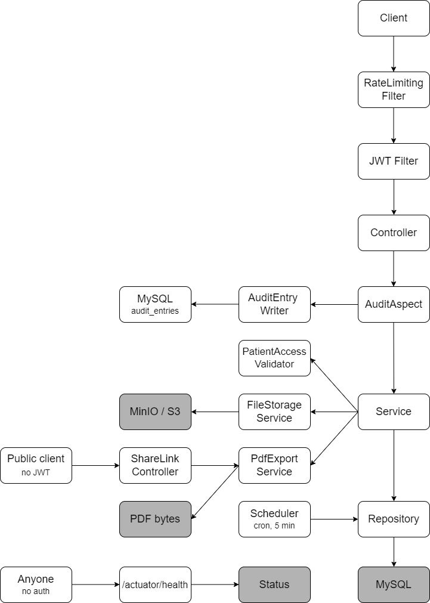

# 🩺 Medical Card (Pulse) - Spring Boot Back-End


## 📌 Introduction

**Medical Card** (brand name **Pulse**) is a personal health record (PHR)
back-end developed as part of my Java back-end engineering learning journey.
It replicates the core functionality of a real clinic system and demonstrates
how a production-grade service handles:

- patient self-service medical records
- doctor-side access, scoped strictly to assigned patients
- clinical data entry (visits, allergies, chronic conditions)
- document storage, PDF export, and controlled external sharing

The goal of this project is not simply to build CRUD endpoints, but to design
a **clean, scalable, and secure architecture** that follows production-grade
principles such as:

- layered architecture
- DTO mapping (MapStruct)
- custom exception handling
- Specification pattern for dynamic search
- ownership-based authorization (not just role checks)
- a custom AOP audit aspect
- JWT-based authentication with per-IP rate limiting
- S3-compatible object storage
- Liquibase migrations with indexed hot-path queries
- mocking and integration testing (Testcontainers)

## 🎯 Motivation

This project was built as a deliberate follow-up to an earlier, more complex
project of mine (an e-commerce back-end) — same architectural discipline,
applied to a domain with a very different central problem: not "who owns this
row" under concurrent writes, but **who is allowed to see this patient at
all**.

While working on Medical Card, I focused on solving problems specific to
healthcare-shaped data:

- 🔐 How do you model "a doctor can see exactly the patients assigned to
  them" as a reusable rule, not a copy-pasted check in every service?
- 🧾 How do you keep an audit trail that survives a failed transaction,
  without reaching for Hibernate Envers "magic" you can't fully explain in an
  interview?
- 📄 How do you generate a PDF export once and reuse the exact same pipeline
  for a temporary, tokenized public link — without duplicating the rendering
  logic?
- ⏰ How do you run a periodic reminder scan with no message broker, no
  backpressure, just one instance and one scan?
- 🗄️ How do you move file storage from local disk to S3-compatible object
  storage (MinIO) without changing the service's public contract?
- 🧪 How do you write integration tests that exercise real MySQL *and* real
  object storage, both disposable, both spun up automatically?

Working through these questions sharpened my understanding of authorization
design, Spring AOP, transaction propagation, and infrastructure-as-code
testing.

## 🚀 What this project demonstrates

- 🧠 Clean, layered back-end architecture
- 🔒 Real authorization model — role-based access **and** per-record
  ownership, not just `@PreAuthorize("hasRole(...)")`
- 🛡️ Defensive security practices: rate-limited auth endpoints, no PII in
  logs, indexed queries, graceful shutdown
- 📐 Patterns carried over deliberately from an earlier project and re-applied
  to a new domain (DTO+MapStruct, Specification search, JWT auth, Liquibase,
  centralized exception handling)
- 🏥 A believable clinical workflow end to end

## 📌 Features / Functionality

👤 **Authentication & authorization**
- Register as `PATIENT` or `DOCTOR`, JWT login
- Role-based access control combined with per-record ownership (`CareLink`)
- Rate-limited login/registration (`429` after 5 attempts/minute per IP)

🩺 **Patient medical card**
- Profile with computed age, blood group, emergency contact
- Allergies and chronic conditions, managed by the patient
- Append-only visit history, authored by the assigned doctor

📎 **Documents**
- `multipart/form-data` upload to S3-compatible object storage (MinIO)
- Type/size validation, ownership-checked download, filter by document type

🔊 **Audit log**
- Custom AOP aspect (`@Around`) wraps every state-changing service method
- Writes in its own `REQUIRES_NEW` transaction, so a `FAILURE` is recorded
  even when the underlying business transaction rolls back

⏰ **Reminders**
- Patient-created medication/appointment reminders
- `@Scheduled` cron job flags overdue ones every 5 minutes

📄 **PDF export & temporary share link**
- Thymeleaf template rendered to PDF via openhtmltopdf
- A doctor can generate a 48-hour public, tokenized link that reuses the
  exact same export pipeline — no separate rendering code path

🔍 **Filtering and searching**
- Powered by the **Specification** pattern for a doctor's paginated,
  searchable patient list

✅ **Validation**
- Spring Validation annotations on every DTO, plus a custom `@PasswordMatch`
  validator

🔐 **Security**
- JWT authentication, ownership checks on every patient record, per-IP rate
  limiting, indexed hot-path queries

🧪 **Testing**
- Mockito-based unit tests for every service
- Integration tests against real, disposable MySQL and MinIO containers
  (Testcontainers)

Overall, this section demonstrates a realistic clinical workflow:
**`register → get linked to a doctor → record a visit → export or share the card`**

## 🏗 Architecture & Technology Stack

This project follows a **layered architecture** to separate concerns and keep
it maintainable:

- **Presentation Layer / Controller** — handles HTTP requests, implements the
  REST endpoints
- **Service Layer** — business rules, ownership checks, transaction
  boundaries
- **Repository Layer** — Spring Data JPA against MySQL, with indexes on every
  hot-path query
- **DTO Layer** — MapStruct-mapped request/response contracts, decoupled from
  entities
- **AOP Layer** — a single `@Around` aspect drives the entire audit log
- **Security Layer** — JWT authentication, method-level authorization, per-IP
  rate limiting
- **Exception Handling** — one centralized `@RestControllerAdvice` with a
  handler per custom exception
- **Testing Layer** — Mockito for services, Testcontainers (MySQL + MinIO)
  for repositories/controllers

## Technology Stack

| Technology / Tool             | Version         | Purpose                                                        |
|--------------------------------|------------------|------------------------------------------------------------------|
| Java                            | 17               | Core programming language                                        |
| Spring Boot                     | 3.2.4            | Application framework                                             |
| Spring Security + JWT           | Boot-managed + jjwt 0.11.5 | Authentication & authorization                       |
| MySQL                           | 8                | Database                                                          |
| Hibernate                       | 6.4 (Boot-managed) | ORM; entity-to-table mapping, schema validation                |
| Liquibase                       | Boot-managed     | Database migration & versioning, with performance indexes         |
| MapStruct                       | 1.5.5.Final      | DTO ↔ entity mapping                                              |
| AWS SDK v2 (S3)                 | 2.25.60          | S3-compatible object storage client (MinIO in dev/compose)        |
| openhtmltopdf                   | 1.0.10           | HTML (Thymeleaf) → PDF rendering for card export                  |
| Spring Boot Actuator            | Boot-managed     | Health checks, metrics                                            |
| JUnit 5 / Mockito / Testcontainers | 5.10.2 / Boot-managed / Boot-managed | Unit and integration testing         |
| Docker / Docker Compose         | -                | Containerization of app, MySQL, and MinIO                         |
| Swagger (springdoc-openapi)     | 2.5.0            | API documentation & testing                                        |

## Design Patterns && Architecture Concepts

| Concept / Pattern               | Purpose                                                     |
|-----------------------------------|-----------------------------------------------------------|
| Layered Architecture              | Maintainable, scalable system                              |
| Repository Pattern                | Clean separation of data access logic                      |
| Specification Pattern             | Dynamic, paginated search of a doctor's patients            |
| AOP Audit Aspect                  | Cross-cutting "who changed what, when" without touching business code |
| Ownership Validator               | One reusable rule for "is this doctor allowed to see this patient" |
| DTO + MapStruct                   | Clean API contracts, decoupled from JPA entities            |
| Centralized Exception Handling    | Predictable, consistent error responses                     |
| Rate Limiting Filter              | Simple in-memory sliding-window guard on auth endpoints      |

<div align="center">

## System Diagram



</div>

Entity-relationship diagram and package layout:
[`docs/ARCHITECTURE.md`](docs/ARCHITECTURE.md).

## 🐳 Infrastructure & Deployment

The application is fully containerized using Docker and Docker Compose, so
anyone can run the full stack without installing Java, Maven, or MySQL
locally.

- **Docker** — packages the Spring Boot application with a predefined Java
  runtime, plus `curl` for its own container healthcheck against
  `/actuator/health`
- **Docker Compose** — orchestrates three containers:
  - Spring Boot application
  - MySQL database (with a healthcheck gate before the app starts)
  - MinIO (S3-compatible object storage, with its own healthcheck gate)

This mirrors real-world deployment practice: the app only starts once its
dependencies report healthy, and the app itself only reports healthy once its
own `/actuator/health` responds.

## 🛠 Local Setup / Getting Started

The application is fully containerized and can be started locally without
manual database setup, Liquibase configuration, or environment tuning.

### 1. Prerequisites

- **Docker**
- **Docker Compose**
- A web browser (for Swagger UI)

```bash
docker --version
docker compose version
```

### 2. Clone the repository

```bash
git clone <this-repo-url>
cd medical-card-application
```

### 3. Configure environment

```bash
cp .env.template .env
```

These are throwaway local values, safe to paste as-is for a review run:

```
MYSQLDB_DATABASE=medical_card_application
MYSQLDB_USER=medcard_user
MYSQLDB_PASSWORD=medcard_pass
MYSQLDB_ROOT_PASSWORD=root_pass
JWT_SECRET=local-review-secret-key-please-change-in-production
MINIO_ROOT_USER=medcard_storage
MINIO_ROOT_PASSWORD=medcard_storage_pass
STORAGE_BUCKET=medical-card-documents
```

▶️ Run the Application (Docker)

```bash
docker compose up --build
```

This command will:
- **build the Spring Boot application image** (with a container healthcheck)
- **start the MySQL database container**
- **start the MinIO object storage container** and create the documents
  bucket automatically on first boot
- **apply Liquibase migrations automatically**
- **launch the application in a ready-to-use state**

🛑 Stop the Application

```bash
docker compose down          # stop containers, keep the data volumes
docker compose down -v       # stop and wipe all data volumes too
```

### 4. Try it out

```bash
# Register a patient
curl -X POST http://localhost:8080/api/auth/registration \
  -H "Content-Type: application/json" \
  -d '{
        "email": "patient@example.com",
        "password": "password123",
        "repeatPassword": "password123",
        "fullName": "Jane Patient",
        "role": "PATIENT"
      }'

# Log in
curl -X POST http://localhost:8080/api/auth/login \
  -H "Content-Type: application/json" \
  -d '{"email": "patient@example.com", "password": "password123"}'
# → { "token": "..." }

# Read your own card
curl http://localhost:8080/api/patients/me \
  -H "Authorization: Bearer <token>"
```

Register a second account with `"role": "DOCTOR"` to try the doctor-side
endpoints (`/api/care-links`, viewing an assigned patient's card, recording a
visit, etc.) — see Swagger UI for the full list.

> Login and registration are rate-limited (5 requests/minute per IP) — you'll
> get `429 Too Many Requests` if you hit either endpoint faster than that.

> `ADMIN` accounts can't self-register on purpose; to try the
> `/api/audit-entries` or `/actuator/metrics` endpoints, insert an admin row
> directly: `docker compose exec mysqldb mysql -uroot -p<MYSQLDB_ROOT_PASSWORD> medical_card_application`,
> then `UPDATE users SET role = 'ADMIN' WHERE email = '...';`.

## Running the tests

```bash
./mvnw test
```

Unit tests (Mockito) run with no external dependencies. Repository/controller
integration tests use [Testcontainers](https://testcontainers.com/) to spin up
a real, disposable MySQL container **and** a real, disposable MinIO container
— Docker must be running for those.

## 📘 API Documentation

All endpoints are documented in Swagger UI:
[Open Swagger UI](http://localhost:8080/swagger-ui.html)

Health check: [http://localhost:8080/actuator/health](http://localhost:8080/actuator/health)
MinIO console: [http://localhost:9001](http://localhost:9001)

## 📌 Final Notes

This project reflects my approach to back-end engineering: thoughtful
architecture, clear separation of concerns, security-first design, and
realistic workflows — deliberately scoped a notch below my previous project's
complexity, so every design decision here (AOP over Envers, a hand-written
rate limiter over a library, one shared PDF pipeline for two entry points)
is one I can defend in detail. It's both a learning milestone and a
foundation for future production-ready systems.
