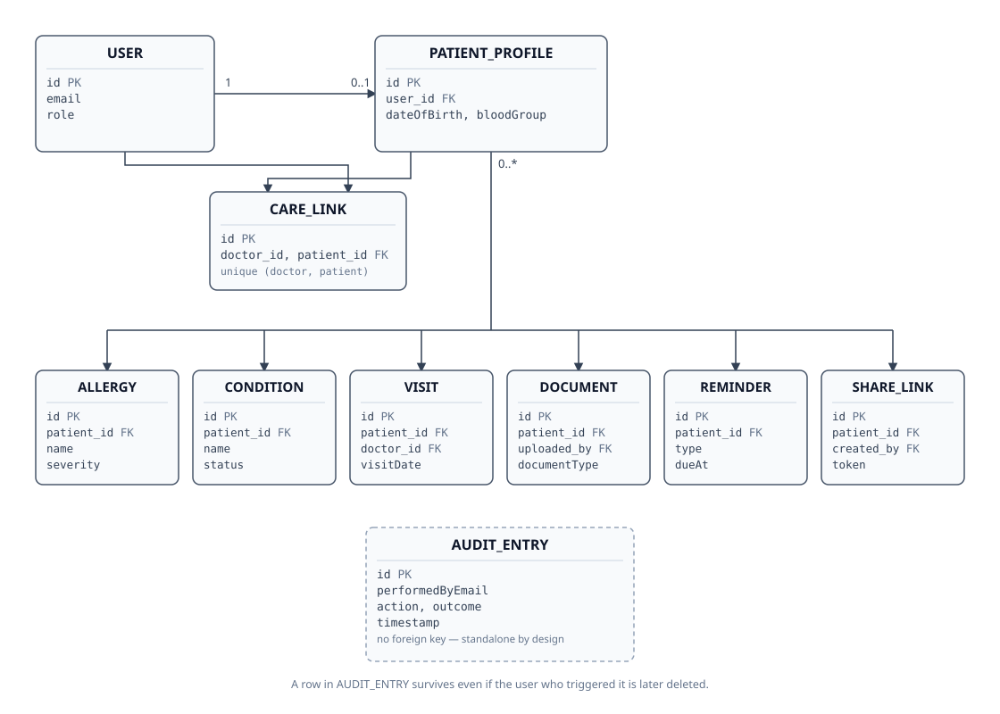

# Medical Card (Pulse) — Technical Architecture

Portfolio backend for a personal health record (PHR) service. A patient owns and
edits their own medical card; an assigned doctor (linked via `CareLink`) can view
and add clinical data to it. Built with Java 17, Spring Boot 3.2, MySQL 8, JWT
auth, Liquibase, MapStruct, and a small custom AOP audit layer.

Both diagrams below are hand-drawn (draw.io for the request flow, plain SVG
for the ER diagram) rather than auto-laid-out, so every connector lands
exactly where it should.

---

## 1. Tech stack

| Layer            | Technology                                      |
|-------------------|--------------------------------------------------|
| Language / runtime | Java 17, Spring Boot 3.2.4                       |
| Web                | Spring MVC (REST), springdoc-openapi (Swagger)   |
| Security           | Spring Security, JWT (jjwt), method-level `@PreAuthorize`, per-IP rate limiting on auth |
| Persistence        | Spring Data JPA / Hibernate, MySQL 8, indexed hot-path queries |
| Migrations         | Liquibase (YAML changesets)                      |
| Mapping            | MapStruct                                        |
| Cross-cutting      | Spring AOP (`AuditAspect`), `@Scheduled` (reminders) |
| Documents          | S3-compatible object storage (MinIO, AWS SDK v2) + `multipart/form-data` |
| PDF export         | Thymeleaf (HTML template) + openhtmltopdf         |
| Observability      | Spring Boot Actuator (`/actuator/health`, `/metrics`) |
| Tests              | JUnit 5, Mockito, Testcontainers (MySQL + MinIO), MockMvc |
| Packaging          | Docker, Docker Compose, container healthchecks    |

---

## 2. Package layout

```
com.vitaliy.medcard
 ├─ configuration    Security, Swagger beans
 ├─ controller        REST endpoints (one class per resource)
 ├─ dto                Request/response records + classes
 ├─ exception          Custom RuntimeExceptions
 ├─ handler            GlobalExceptionHandler (@RestControllerAdvice)
 ├─ mapper             MapStruct interfaces
 ├─ model              JPA entities
 │   └─ status         Enums (UserRole, DocumentType, ...)
 ├─ repository         Spring Data JPA repositories
 │   └─ specification  CareLinkSpecifications (dynamic search)
 ├─ aspect             @Audited annotation + AuditAspect + AuditEntryWriter
 ├─ scheduler          ReminderScanScheduler (@Scheduled)
 ├─ security            JwtUtil, JwtAuthenticationFilter, CurrentUserService
 ├─ service            Interfaces
 │   └─ impl           Implementations
 ├─ util               AgeCalculator (shared, stateless helpers)
 └─ validation         PasswordMatch, PatientAccessValidator
```

---

## 3. How everything fits together


---

## 4. Entity-relationship diagram



`AUDIT_ENTRY` is drawn with no relationship lines on purpose — it has no FK at
all, just a `performedByEmail` string, so a row survives even after the user
who triggered it is deleted.

---

## 5. API surface (by controller)

| Controller                     | Base path                          | Notes |
|---------------------------------|--------------------------------------|-------|
| `AuthenticationController`      | `/api/auth`                          | public |
| `PatientProfileController`      | `/api/patients`                      | `/me` = patient, `/{id}` = doctor/admin |
| `CareLinkController`            | `/api/care-links`                    | includes `/my-patients` search+paging |
| `AllergyController`             | `/api/patients/me\|{id}/allergies`   | |
| `ConditionController`           | `/api/patients/me\|{id}/conditions`  | |
| `VisitController`               | `/api/patients/me\|{id}/visits`      | append-only |
| `DocumentController`            | `/api/patients/me\|{id}/documents`   | multipart upload, download |
| `ReminderController`            | `/api/patients/me/reminders`         | patient-only |
| `PatientCardExportController`   | `/api/patients/me\|{id}/export`      | PDF |
| `ShareLinkController`           | `/api/patients/{id}/share-links`,<br>`/api/share-links/{token}/export` | second path is PUBLIC |
| `AuditEntryController`          | `/api/audit-entries`                 | ADMIN only |

Full request/response contracts are in Swagger UI at `/swagger-ui.html`.
